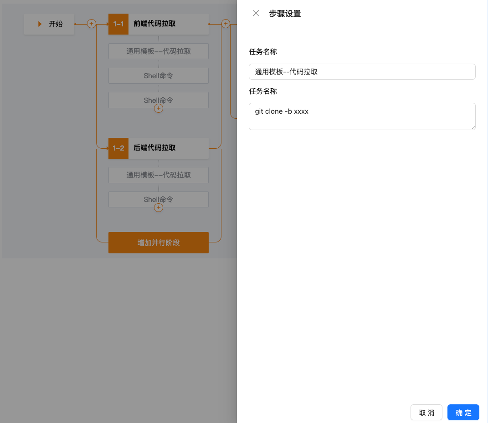
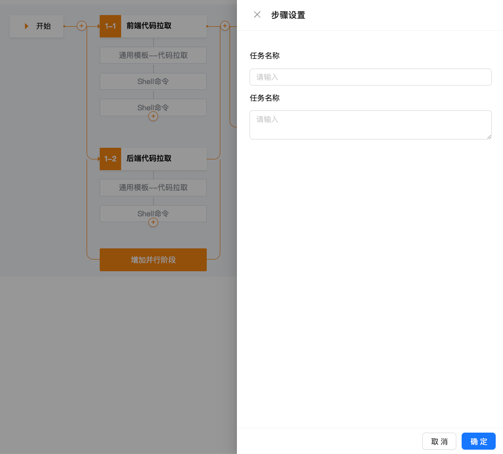
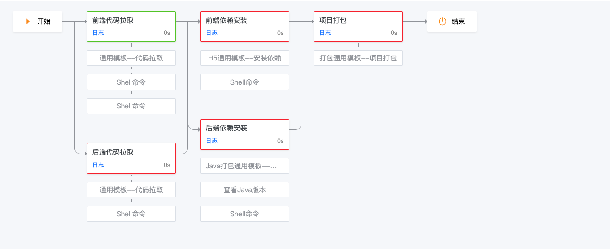

# Pipeline

## Preview








## Usage

- Pipeline Stage

```tsx
import type { IPipelineProps } from 'pipeline'
import { Pipeline } from 'pipeline'

const data: IPipelineProps = {
    groups: [
        [
            {
                title: {
                    label: '前端代码拉取',
                },
                steps: [
                    {
                        label: '通用模板--代码拉取',
                        command: 'git clone -b xxxx',
                    },
                    {
                        label: 'Shell命令',
                        command: 'cd /usr/local/',
                    },
                    {
                        label: 'Shell命令',
                        command: 'cd /usr/local/nginx',
                    },
                ],
            },
            {
                title: {
                    label: '后端代码拉取',
                },
                steps: [
                    {
                        label: '通用模板--代码拉取',
                        command: 'git clone -b xxxx',
                    },
                    {
                        label: 'Shell命令',
                        command: 'java --version',
                    },
                ],
            },
        ],
        [
            {
                title: {
                    label: '前端依赖安装',
                },
                steps: [
                    {
                        label: 'H5通用模板--安装依赖',
                        command: 'npm install',
                    },
                    {
                        label: 'Shell命令',
                        command: 'nvm use 16.20',
                    },
                ],
            },
            {
                title: {
                    label: '后端依赖安装',
                },
                steps: [
                    {
                        label: 'Java打包通用模板--安装依赖',
                        command: 'java run',
                    },
                    {
                        label: '查看Java版本',
                        command: 'java -version',
                    },
                    {
                        label: 'Shell命令',
                        command: 'javac',
                    },
                ],
            },
        ],
        [
            {
                title: {
                    label: '项目打包',
                },
                steps: [
                    {
                        label: '打包通用模板--项目打包',
                        command: 'run pack',
                    },
                ],
            },
        ],
    ],
}

<Pipeline {...props.data} />
```    

- Pipeline View
```tsx
import type { IPipelineViewProps } from 'pipeline'
import { PipelineView } from 'pipeline'

const data: IPipelineViewProps = {
    step: [0, 1],
    groups: [
        [
            {
                title: {
                    label: '前端代码拉取',
                },
                status: 2,
                steps: [
                    {
                        label: '通用模板--代码拉取',
                        command: 'git clone -b xxxx',
                    },
                    {
                        label: 'Shell命令',
                        command: 'cd /usr/local/',
                    },
                    {
                        label: 'Shell命令',
                        command: 'cd /usr/local/nginx',
                    },
                ],
            },
            {
                title: {
                    label: '后端代码拉取',
                },
                status: 3,
                steps: [
                    {
                        label: '通用模板--代码拉取',
                        command: 'git clone -b xxxx',
                    },
                    {
                        label: 'Shell命令',
                        command: 'java --version',
                    },
                ],
            },
        ],
        [
            {
                title: {
                    label: '前端依赖安装',
                },
                status: 3,
                steps: [
                    {
                        label: 'H5通用模板--安装依赖',
                        command: 'npm install',
                    },
                    {
                        label: 'Shell命令',
                        command: 'nvm use 16.20',
                    },
                ],
            },
            {
                title: {
                    label: '后端依赖安装',
                },
                status: 3,
                steps: [
                    {
                        label: 'Java打包通用模板--安装依赖',
                        command: 'java run',
                    },
                    {
                        label: '查看Java版本',
                        command: 'java -version',
                    },
                    {
                        label: 'Shell命令',
                        command: 'javac',
                    },
                ],
            },
        ],
        [
            {
                title: {
                    label: '项目打包',
                },
                status: 3,
                steps: [
                    {
                        label: '打包通用模板--项目打包',
                        command: 'run pack',
                    },
                ],
            },
        ],
    ],
}

<PipelineView {...data} />
```
